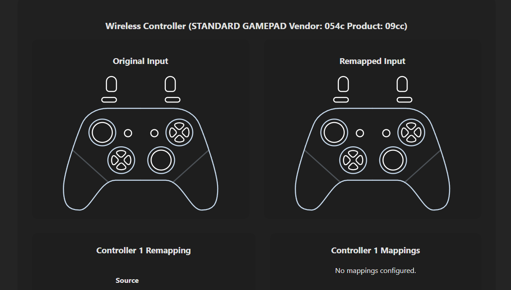

# Gamepad Remapper

A simple tool for remapping gamepad inputs. Allows you to override buttons and axes with custom mappings.

## Features

- Visual representation of both original and remapped inputs
- Intuitive remapping interface with "press to select" functionality
- Support for button-to-button and axis-to-axis mapping
- Real-time feedback showing button states

## Usage

1. Connect your gamepad
2. Select source and target buttons/axes
3. Add mappings to create your custom controller layout
